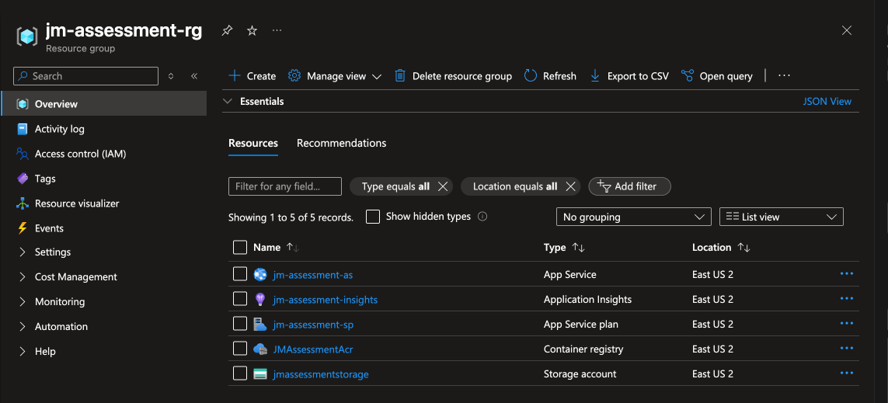
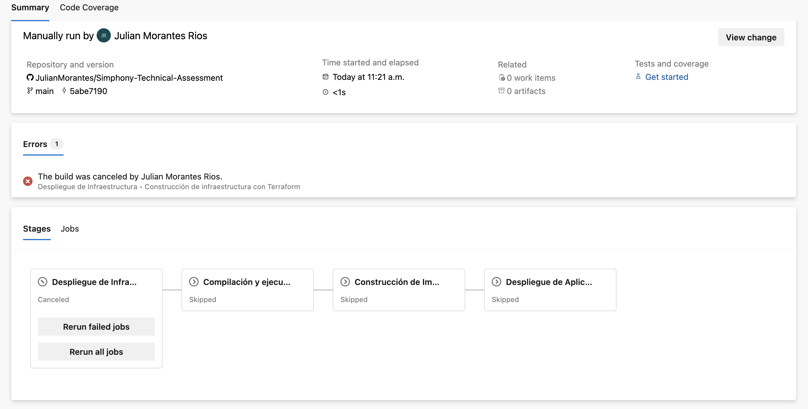

# Simphony-Technical-Assessment
Prueba tecnica Julian Morantes
---
## 📁 Estructura de Carpetas

```text
📦Proyecto
├── 📁 Infra                   # Infraestructura como código con Terraform
│   ├── main.tf                # Archivo principal
│   ├── variables.tf           # Variables globales
│   ├── outputs.tf             # Salidas de interés
│   ├── terraform.tfvars       # Variables de ocnfiguracion incial default
│   └── 📁 modules
│       ├── 📁 resource_group        # Módulo de Construccion de Grupo de recursos
│       ├── 📁 service_plan          # Módulo de Construccion de recurso Azure Service plan
│       ├── 📁 app_service           # Módulo de Constriccion de App Service container
│       ├── 📁 container_registry    # Módulo contruccion de ACR
│       ├── 📁 storage_account       # Módulo contruccion de Azure Storage Acount
│       └── 📁 application_insights  # Módulo de configuracion para Aplication Insights
│       
├── 📁 Pipeline
│   ├── azure-pipeline.yaml   #Archivo de despliegue yaml que ejecuta los stages necesarios para crear la infraestructura y desplegar las aplicaciones.   
│   └── 📁 templates  #Archivos template que implementa procesos especificos para los pipelines
│       ├── app-templates.yml
│       ├── img-docker-templates.yml
│       ├── destroy-infra-templates.yml
│       └── infra-templates.yml
├── answers.md
└── README.md

```
---

# Guía de Implementación y Ejecución de Pipeline CI/CD en Azure DevOps

## 1. Requerimientos Previos

Antes de ejecutar el pipeline, asegúrate de cumplir con los siguientes requisitos:

### 1.1. Tener una Cuenta de Azure

Es necesario tener una cuenta activa de Azure y configurar tu suscripción correctamente para interactuar con los recursos desde Azure DevOps.

#### Pasos para configurar la cuenta de Azure:

1. **Iniciar sesión en Azure CLI:**
   Ejecuta el siguiente comando para iniciar sesión en tu cuenta de Azure:
   ```bash
   az login
   ```
   Este comando abrirá una ventana del navegador donde deberás autenticarte con tus credenciales de Azure.

2. **Seleccionar la suscripción de Azure:**
   Si tienes varias suscripciones de Azure, selecciona la suscripción correcta usando:
   ```bash
   az account set --subscription "Your-Subscription-ID"
   ```

3. **Verificar la suscripción activa:**
   Ejecuta el siguiente comando para asegurarte de que tienes la suscripción correcta activa:
   ```bash
   az account show
   ```

---

## 2. Configurar una Cuenta de Azure

Es necesario tener una cuenta activa de Azure y configurar tu suscripción correctamente para interactuar con los recursos desde Azure DevOps.

#### Pasos para configurar la cuenta de Azure:

1. **Iniciar sesión en Azure CLI:**
   Ejecuta el siguiente comando para iniciar sesión en tu cuenta de Azure:
   ```bash
   az login
   ```
   Este comando abrirá una ventana del navegador donde deberás autenticarte con tus credenciales de Azure.

2. **Seleccionar la suscripción de Azure:**
   Si tienes varias suscripciones de Azure, selecciona la suscripción correcta usando:
   ```bash
   az account set --subscription "Your-Subscription-ID"
   ```

3. **Verificar la suscripción activa:**
   Ejecuta el siguiente comando para asegurarte de que tienes la suscripción correcta activa:
   ```bash
   az account show
   ```

---

## 3. Crear una Librería de Variables en Azure DevOps

Azure DevOps te permite crear librerías de variables para almacenar valores que se utilizarán a lo largo de los pipelines de manera centralizada.

#### Pasos para crear una librería de variables:

1. **Acceder a Azure DevOps:**
   Inicia sesión en tu cuenta de Azure DevOps desde [https://dev.azure.com/](https://dev.azure.com/).

2. **Crear una librería de variables:**
   1. Dirígete a tu organización y proyecto en Azure DevOps.
   2. En la barra lateral, selecciona **Pipelines** y luego ve a **Library**.
   3. Haz clic en **+ New variable group** para crear una nueva librería de variables.
   4. Asigna un nombre a la librería (por ejemplo, `jm-simphony-assessment`).
   5. Agrega las siguientes variables con sus valores respectivos:

   | Key                              | Value                            |
   | --------------------------------- | --------------------------------|
   | `dockerRegistry`                  | `Tu docker register`            |
   | `dockerImageTag`                  | `Tag de imagen a utilizar`      |
   | `dockerImageName`                 | `Bombre de app node`            |
   | `webAppName`                      | `Nombre dapp service`           |
   | `azureSubscription`               | `AzureServiceConnection`        |
   | `azureContainerRegistryServiceConnection` | `name service conection ACR`  |
   | `azureTFServiceConnection`        | `Nómbrense service connection TF` |

   6. **Guardar** la librería de variables.

---

## 4. Configurar Conexiones de Servicio en Azure DevOps

Para que el pipeline pueda interactuar con Azure y Terraform, debes configurar las conexiones de servicio necesarias en Azure DevOps.

#### Pasos para configurar la conexión de servicio de Azure:

1. **Conexión de servicio de Azure (para interactuar con Azure):**
   - Ve a **Project Settings** > **Service connections**.
   - Haz clic en **+ New service connection**.
   - Selecciona **Azure Resource Manager** y sigue los pasos para autenticarte con tu cuenta de Azure. Usa la suscripción correcta para autorizar la conexión.

2. **Conexión de servicio de Azure Container Registry (ACR):**
   - Ve a **Project Settings** > **Service connections**.
   - Haz clic en **+ New service connection**.
   - Selecciona **Docker Registry** y usa las credenciales de tu Azure Container Registry para completar la conexión.

3. **Conexión de servicio de Terraform (para ejecutar Terraform desde Azure DevOps):**
   - Ve a **Project Settings** > **Service connections**.
   - Haz clic en **+ New service connection**.
   - Selecciona **Terraform** y completa los detalles de la conexión.

---

## 5. Ejecutar el Pipeline de Forma Manual

Con todo configurado, ahora puedes ejecutar el pipeline de manera manual. Sigue estos pasos:

1. **Acceder al pipeline:**
   - Ve a **Pipelines** dentro de tu proyecto en Azure DevOps.
   - Encuentra el pipeline que creaste para la construcción de infraestructura, la compilación de la aplicación Node.js, la construcción de la imagen Docker y el despliegue.

2. **Iniciar la ejecución:**
   - Haz clic en el pipeline y luego en **Run Pipeline**.
   - Asegúrate de seleccionar la rama correcta (por ejemplo, `main`) y confirmar las variables necesarias para la ejecución.

3. **Verificar el estado de la ejecución:**
   - Puedes revisar el progreso del pipeline en tiempo real. Si alguna parte del proceso falla, los logs detallarán el error para facilitar la solución de problemas.

---

# 📦 Variables para Terraform en Azure DevOps

Estas variables deben ser agregadas a la **librería de variables** en Azure DevOps bajo el grupo:  
**`jm-simphony-assessment`**

## 🌍 Variables de infraestructura

| Nombre de Variable     | Valor Sugerido          | Descripción                                 |
|------------------------|-------------------------|---------------------------------------------|
| `resource_group_name`  | `jm-assessment-rg`      | Nombre del Resource Group en Azure         |
| `location`             | `eastus`                | Región donde se desplegarán los recursos   |
| `acr_name`             | `jmassessmentacr`       | Nombre del Azure Container Registry        |
| `app_service_name`     | `jm-assessment-as`      | Nombre del Azure App Service               |
| `service_plan_name`    | `jm-assessment-plan`    | Nombre del App Service Plan asociado       |

> ✅ Estas variables serán utilizadas dentro de los archivos Terraform para parametrizar los recursos.

---

⚠️ Recuerda también incluir las conexiones de servicio necesarias (`azureTFServiceConnection`) como variable o directamente como parámetro en tareas de Azure CLI o Terraform.


## **Paso 6: Creación de la Infraestructura**

Si has seguido los pasos y configuraciones correctamente, al ejecutar el primer paso del pipeline deberías ver la creación de un **Grupo de Recursos** en tu cuenta de Azure. Este grupo de recursos contendrá todos los recursos necesarios para la prueba.

### Recursos creados:

- **Grupo de recursos** que contiene las aplicaciones, redes y servicios necesarios.
- **Instancias de App Services** o **Contenedores Docker** implementados en Azure.
- **Cuentas de almacenamiento** y otros recursos dependientes como registros de contenedores (ACR), bases de datos, entre otros.

### Ver imagen de ejemplo:



## 🧩 Paso 7: Creación de los Pipelines y Stages
Una vez que hayas configurado correctamente los templates, las variables y las conexiones de servicio necesarias, es momento de crear tu pipeline en Azure DevOps.

Este pipeline consta de los siguientes cuatro stages:

### Infrastructure
Despliegue de la infraestructura en Azure utilizando Terraform.
Incluye recursos como: Resource Groups, App Services, Storage Accounts, etc.

### Build and Quality
Compilación de la aplicación Node.js y análisis de calidad estática del código utilizando SonarCloud (si está habilitado mediante variable de entorno).

### Docker Image
Construcción de la imagen Docker a partir del artefacto generado en el paso anterior.
Luego, esta imagen es subida al Azure Container Registry (ACR).

### Release
Despliegue de la imagen generada a un Azure Web App configurado para contenedores.
Este paso utiliza el nombre del Web App y del ACR configurados previamente.




✅ Resultado Esperado:
Si seguiste correctamente todos los pasos, tu pipeline en Azure DevOps debería visualizarse con estos cuatro stages bien definidos, como se muestra a continuación:

🤝 Agradecimiento
Gracias por la oportunidad de participar en este proceso. Ha sido un reto enriquecedor y muy alineado con mis conocimientos y aspiraciones profesionales en el mundo DevOps y la nube con Azure.

Estoy a disposición para resolver cualquier inquietud o ampliar detalles sobre esta solución. ¡Será un gusto continuar en contacto!

📬 Datos de contacto
Julián Eusebio Morantes Ríos
📧 morat26@gmail.com
💼 LinkedIn: https://www.linkedin.com/in/julian-eusebio-morantes-rios-641881123/